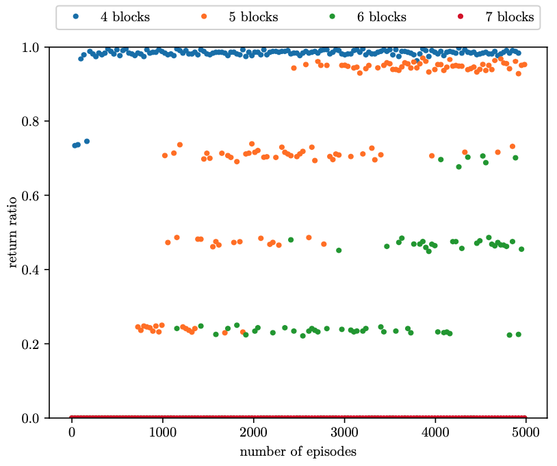
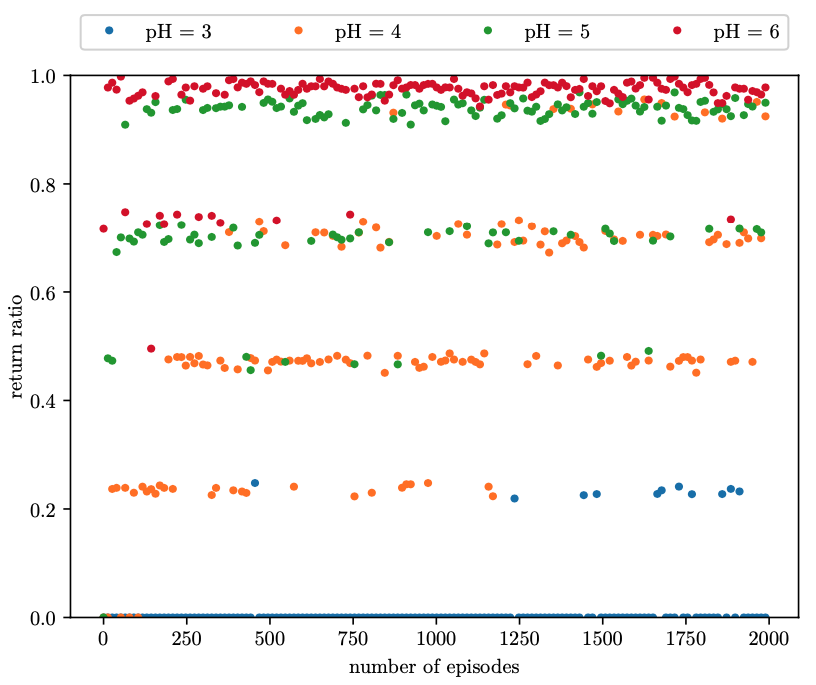
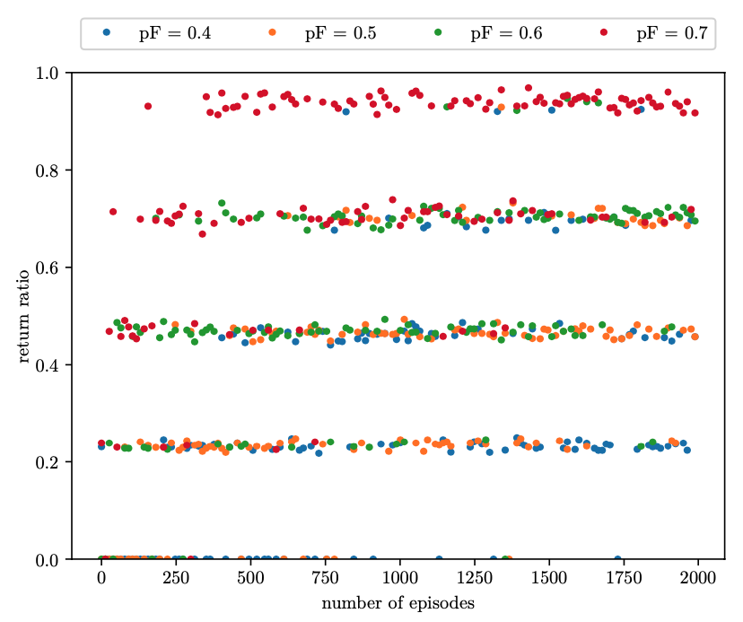

# Experiment 1

To reproduce the results from the bachelor's thesis

# Experiment 1a

# Experiment 1a
## Comparison with bachelor's thesis
{height=80%}

# Experiment 1a
## Remarks
Results are in line with those of the bachelor's thesis.

# Experiment 1b

# Experiment 1b
## Comparison with bachelor's thesis
{height=80%}

# Experiment 1b
## Remarks

* The results seem to be shifted! 

	* $pH = 3$ in the thesis seems roughly equal to $pH = 4$ in my work.
	* $pH = 4$ in the thesis seems roughly equal to $pH = 5$ in my work.
	* $pH = 5$ in the thesis seems roughly equal to $pH = 6$ in my work.
	* My results were generated automatically. Further, The results here were consistent with those in Experiment 2b. Thus, it is unlikely that I made a mistake.
	* In my experiment, the planning horizon shows clear effect. Thus, I also don't think that there is a mistake in the learning agents code.

# Experiment 1c

The original output (left) is too messy. Used running average to smooth the result and make it more readable (right).

# Experiment 1c
## Comparison with bachelor's thesis
{height=80%}

# Experiment 1c
## Remarks
Only the first 1000 episodes were rendered (vs. 2000 in the bachelor's thesis). It's hard to say because of the noise, but the results look similar to those in the thesis.

# Conclusion

* Overall, the results seem to be in line with that of the bachelor's thesis.
* A low sample size ($n=4$) may skew the results
* Generating results took ca. 4-13 hours. The blocks world size has a big impact on performance.
	* *Possible culprit:* Computing the return rate is expensive. It requires computing optimal plans for every step.
	* *Possible culprit:* Computing plans is expensive. For every state, the optimal return up to the planning horizon is computed, even if no answer set leads to a correct solution.
	* **Update** Removed some redundant ASP-solver calls, now the simulation is much faster. However, the points above are still valid.
